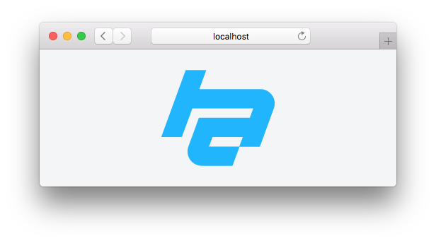

#  @whaaaley/launchpad

> Boilerplate for building web applications.

[**View Demo**](https://launchpad-demo.netlify.com/)



## Install and Setup

```
make setup
```

## Scripts

Ensure you have GNU make version 3.8.2 or above.

[See `Makefile` for details.](Makefile)

### Start development

Start a development server at [`http://localhost:3000/`](http://localhost:3000/) and watch for changes.

```
make start
```

### Build for production

Set `NODE_ENV='production'` in your `.env` file.

```
make
```

## Deployment

This project uses Netlify to deploy when commits are pushed to master.

[View the Netlify dashboard for this project.](https://app.netlify.com/sites/launchpad-demo)
